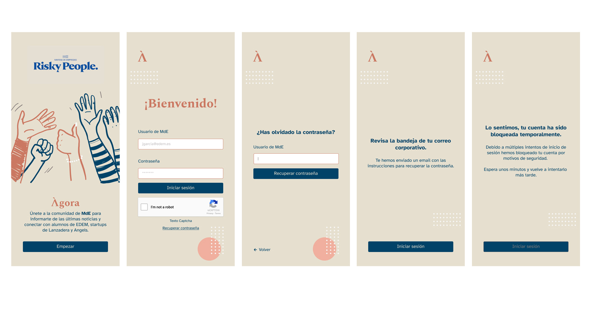
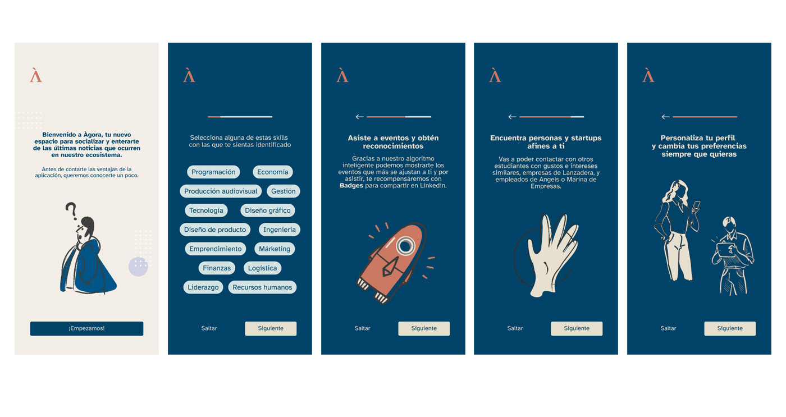

# ÁGORA 📅
## Descripción del proyecto
[⬆️](#índice)

>*ÁGORA es un término griego que significa plaza o punto de reunión y esa es la metáfora que se ha empleado para vertebrar esta WebApp dedicada a conectar a los estudiantes de EDEM con el resto del ecosistema de Marina de Empresas ,formado por LANZADERA y ANGELS.

Ágora solo es accesible a los alumnos que cursen o hayan cursado formación en EDEM. 
>Sus principales características son:
>- [X] Acceso seguro mediante login con triple factor de autenticación
>- [X] Seguridad mediante CAPTCHA
>- [X] Home con acceso a menú diario de cafetería
>- [X] Noticias de Marina de Empresas
>- [X] Posibilidad de comentar noticias y dar like a las mismas
>- [X] Filtrado de palabras malsonantes en comentarios mediante el uso de IA
>- [X] Eventos personalizados para cada usuario mediante el empleo de IA
>- [X] Catálogo de eventos general
>- [X] Panel de notificaciones de usuario con las noticias y eventos no vistos
>- [X] Chat en tiempo real para conectar a los usuarios del ecosistema de MdE 
>- [X] Opción para eliminar conversaciones
>- [X] Panel de perfil de usuario con foto y enlaces a perfiles profesionales
>- [X] En perfil de usuario se añaden y editan las preferencias de eventos

>El despliegue del frontend de la WebApp de ágora lo hemos realizado en la siguiente plataforma:

| PLATAFORMA    | USO |
| :-----------:   | :---------- |
|RAILWAY         |Plataforma de despligue,donde conectamos con el servidor de backend que a su vez permite entregar información desde y hacia la base de datos. |

***
# TRELLO 📅
## Enlace al tablero de trabajo ONLINE del proyecto

>[Ir a TRELLO](https://trello.com/b/YZw8dkKS/g2-tripulaciones)

> __Note__
Disponibilidad del tablero depende del creador del grupo de trabajo, ya que está vinculado a su cuenta.

***
# VISTAS
## Login
>Secuencia de vistas que incluye. Por orden:
>- [X] Pantalla de splash!.
>- [X] Vista de LOGIN con triple factor de autenticación (mail + contraseña + captcha).
>- [X] Vista de recuperación de contraseña.
>- [X] Vista de confirmación de correo electrónico.
>- [X] Vista de bloqueo temporal de pantalla login con desactivación de botón.

***
## Acceso usuarios
>Secuencia de vistas que incluye. Por orden:
>- [X] Pantalla de bienvenida.
>- [X] Vista de TAGS para configurar perfil usuario.
>- [X] Vista de información de algoritmo inteligente.
>- [X] Vista de información de "match" de usuarios,eventos e intereses.
>- [X] Vista para informar de la edición de perfil

***

# Herramientas empleadas en el proyecto (TOOLSET) ⚙️
[⬆️](#índice)

>* [*TRELLO*](https://trello.com/) - Planificador de tareas (Versión: no disponible)
>* [*POSTMAN*](https://www.postman.com/) - Software para probar y documentar endpoints (Versión: 10.13.5)
>* [*SWAGGER*](https://swagger.io/) - Plataforma de documentación de API's (Versión: 4.6.2)
>* [*VISUAL STUDIO CODE*](https://code.visualstudio.com/) - Editor de código (Versión: 1.75.1)
>* [*NodeJS*](https://code.visualstudio.com/) - Entorno de ejecución para crear servidores en backend (Versión: 18.15.0)
>* [*Nodemon*](https://www.npmjs.com/package/nodemon/) - Herramienta para desarrollo que levanta el servidor automáticamente tras cada cambio realizado en el código (Versión: 18.15.0)
>* [*MONGODB*](https://www.mongodb.com//) - Gestor de base de datos (Versión: 6.0)
>* [*MONGOOSE*](https://mongoosejs.com/) - Herramienta de modelado de objetos para Node Js (Versión: 7.0.4)
>* [*ATLAS (MONGODB)*](https://cloud.mongodb.com/) - Alojamiento de MONGODB para la/s base/s de datos empleando clústers (Versión: 6.0)
>* [*BCRYPT*](https://code.visualstudio.com/) - Dependencia para la encriptación y comprobación de contraseñas (Versión: 1.4.3)
>* [*JASON WEB TOKEN*](https://code.visualstudio.com/) - Dependencia para generar tokens de acceso (Versión: 9.0.0)
>* [*DOTENV*](https://code.visualstudio.com/) - Dependencia para establecer las variables globales y poder desplegar (Versión: 16.0.3)
>* [*VERCEL*](https://code.visualstudio.com/) - Plataforma para el despliegue del servidor(Versión: 1.75.1)
>* [*Live Server*](https://marketplace.visualstudio.com/items?itemName=ritwickdey.LiveServer) -Extension de Visual Studio para check durante la fase de desarrollo y en entorno local.

***
# Autores ✒️

**Guillermo Soler** - | *Coding* | - [GuilleSoler87](https://github.com/GuilleSoler87)

**Francisco Niederleytner** - | *Coding* | - [pacool1234](https://github.com/pacool1234)

**Joan Baldó** - | *Coding* | - [joanbaldo](https://github.com/joanbaldo)

***
